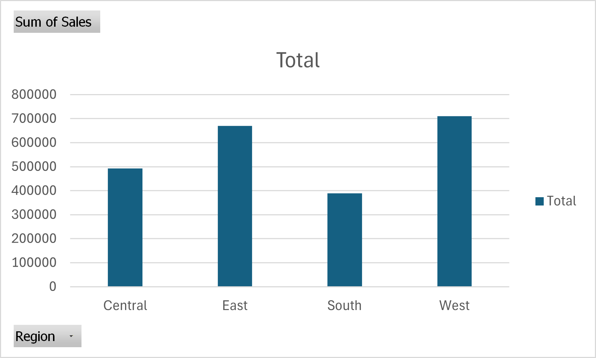
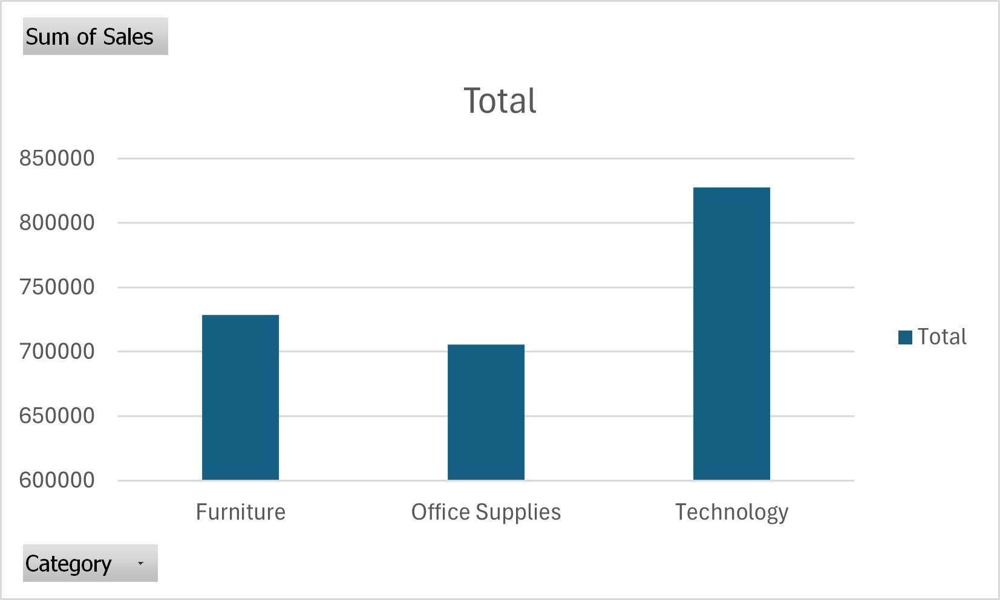
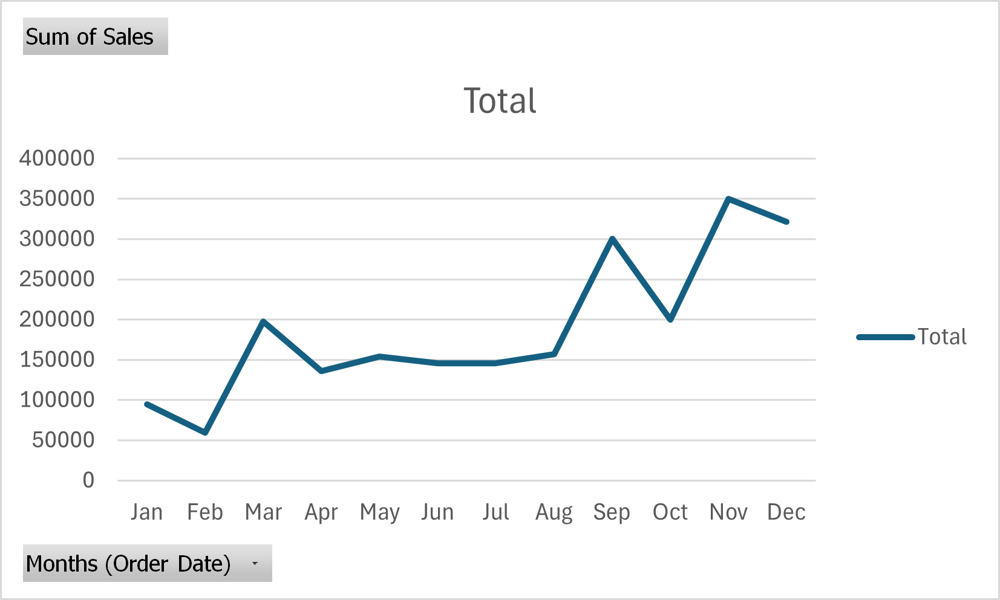
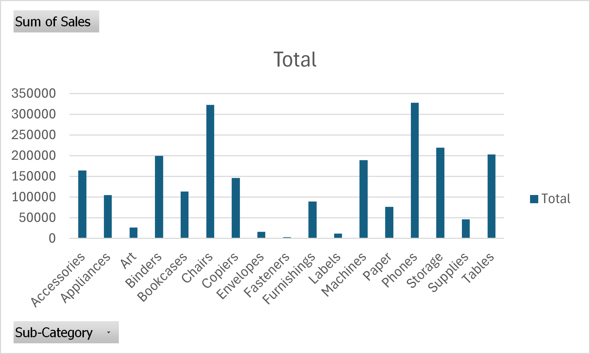

Retail Sales Data Analysis

Project Overview

This project analyzes a retail sales dataset to identify revenue trends, product performance, and regional sales distribution.  
The analysis was performed using SQL queries and Excel visualizations to generate business insights.

 Tools Used

- SQL (Data Analysis)
- Microsoft Excel (Data Visualization)
- XAMPP / MySQL (Database Management)
- HTML (Project Report)

 Dataset

The dataset contains retail order information including:

- Order Date
- Region
- Category
- Sub-Category
- Sales
- Profit

The dataset is located in the "dataset" folder.


 SQL Analysis

Key SQL queries used in this project:

"Total Sales"

```sql
SELECT SUM(Sales) AS total_sales
FROM train;
```

"Revenue by Region"

```sql
SELECT Region, SUM(Sales) AS revenue
FROM train
GROUP BY Region
ORDER BY revenue DESC;
```

"Profit by Category"

```sql
SELECT Category, SUM(Profit) AS profit
FROM train
GROUP BY Category
ORDER BY profit DESC;
```

"Top Selling Products"

```sql
SELECT Sub_Category, SUM(Sales) AS sales
FROM train
GROUP BY Sub_Category
ORDER BY sales DESC
LIMIT 10;
```

 Data Visualizations

Charts were created using Microsoft Excel.

 Sales by Region



 Sales by Category



 Monthly Sales Trend



 Top Product Sub-Categories




 Key Insights

- The West region generated the highest revenue.
- Technology category produced the most sales.
- Sales show seasonal patterns across months.
- Phones and Chairs are top-selling product sub-categories.

 Project Structure

retail-sales-analysis
│
├ dataset
│   └ train.csv
│
├ sql
│   └ analysis.sql
│
├ charts
│   ├ sales_by_region.png
│   ├ sales_by_category.png
│   ├ monthly_sales.png
│   └ top_products.png
│
└ report
    ├ index.html
    └ insights.md
```

---

## Author

**Nimay Desai**

Aspiring Data Analyst
